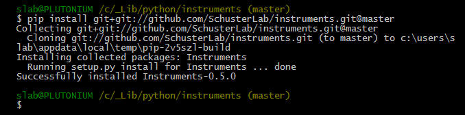

# instruments

## How to Use

There are two ways to install this instrument driver collection.

### 1. from github

do: `pip install git+git://github.com/SchusterLab/instruments.git@master`


### 2. from pip

do `pip install instruments`

### 3. for local development

- First, clone this repository with
   ```shell
   git clone https://github.com/SchusterLab/instruments.git
   ```

- Then inside your github `instruments` folder, do `pip install -e .`. The `.` at the end tells `pip` that you are passing the entire local folder in. This is equivalent to `python setup.py develop`. See here: [stackoverflow](http://stackoverflow.com/questions/2087148/can-i-use-pip-instead-of-easy-install-for-python-setup-py-install-dependen).

## To Contribute:

The benefit of building instrument drivers this way, is that it allows us to have a README for each driver, and a consistent testing convention.

To help fix bugs and create new drivers, and help make everyone's life easier in the lab, I ask you the following:

1. Always write tests for your code.
2. Write up the README nicely, so that the first-year in your lab knows how to use this.

Many thanks to you future contributors in advance!

Ge Yang